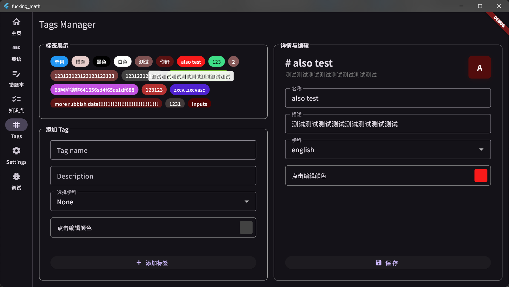
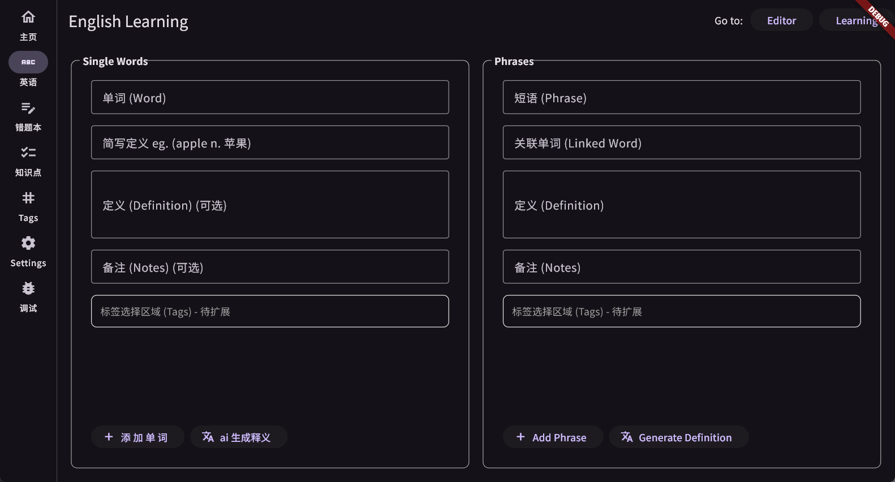

# Fucking Math

> 关于这个接地气的名字：  
> 我非常喜欢数学，但是我被圆锥曲线、三角函数八股文似的公式经常折磨到深夜，怒而起之

为了饱受中学阶段冗长复杂的知识折磨的学生设计。  
这个项目提供了优化手工错题本需要耗费大量时间的解决方案。

> [Warning] 当前版本处于非常早的开发版，故不提供构建，自行构建需要注意在 v0.1.0 之前不会提供数据库更新的方法

## 开发线路

当前版本: v0.0.(commit数)

*仅仅开始开发的功能才会被详细展开，这里只展示了大概路线图，随时会调整*

- [ ] 完成基本信息录入功能 <-- We are here
    - [x] 数据库搭建
    - [x] 英语
        - [x] 仓库类
        - [x] Provider 类
        - [x] 录入部分 UI
        - [x] 重构 UI 代码
        - [x] 整合 tag 功能
    - [x] Tag 管理
        - [x] 仓库类
        - [x] Provider 类
        - [x] UI 
    - [x] 重构部分代码
    - [ ] 知识点
        - [x] 仓库类 
        - [x] Provider 类
        - [x] 重构 provider 结构
        - [ ] 录入部分 UI <-- We are here
    - [ ] 错题
- [ ] 完成数据编辑修改删除 <-- MVP (v0.1.0)
    - [ ] 英语
        - [ ] 单词编辑
- [ ] 完成 AI 框架搭建
- [ ] 结合 AI 与已有数据，实现复习等功能
    - [ ] 使用多模态 AI 识别错题并高效标记

## 大饼

我计划在 2026年2月 之前完成 MVP，在3月之前发布第一个版本

## 关于项目

这是我第一次使用flutter框架写应用，故开发效率极低，加上我大部分的开发时间在晚自习下课后半夜的一个小时之内，所以项目进展较慢。

项目大部分的代码质量不高，因为其完成流程是这样的：  
发送需求与上下文给 AI -> 把 AI 的代码抄过来 -> 专注于下一个功能 -> 上一个功能代码可用性为 0 -> 重写

设想的使用场景(已验证): 带键盘到学校，在空闲时间不影响到其他同学的时候(如中午，体育课)，的时候在教室总结错题，录入单词等不大量需要键盘的功能; 回家后通过手机摄像头录入错题.

(我对这套方案的信心不大，但是我也会在项目完成之后切身实地的去使用，并附上我的成绩变化以供参考)

(这个项目的提交信息全部都是ai写的，ai写这玩意是真好用)

分支：目前全部的开发在main分支中，在 v0.1.0 之后开发迁入 dev 分支

## 技术有关

- **主语言**: Dart
- **UI 框架**: Flutter
- **数据库**: Drift + sqlite3
- **工作模式**: UI -> Proivder -> Repository -> Dao -> DB

## 贡献项目

我急切需要你的加入与贡献!   
如果你在我的代码中发现了bug，欢迎提交issue。
如果你有某部分的经验或者对某部分的开发特别感兴趣，欢迎提交pr。

(我会在有空闲的时候完善这个README，补充一些如pr提交流程的细节)
