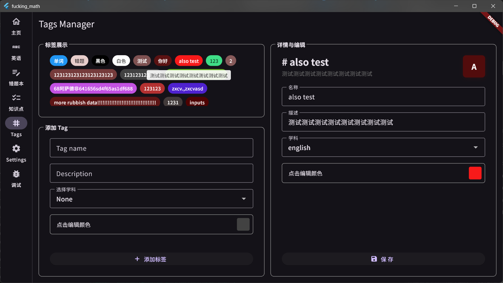
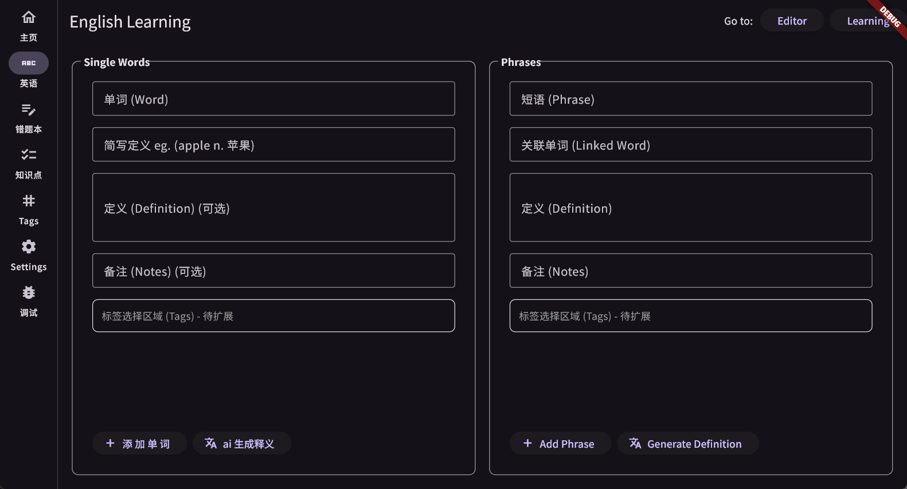

# Fucking Math

> 关于这个接地气的名字：  
> 我非常喜欢数学，但是我被圆锥曲线、三角函数八股文似的公式经常折磨到深夜，怒而起之

为了饱受中学阶段冗长复杂的知识折磨的学生设计。  
这个项目提供了优化手工错题本需要耗费大量时间的解决方案。

> [Warning] 当前版本处于非常早的开发版，故不提供构建，自行构建需要注意在 v0.1.0 之前不会提供数据库更新的方法

## 开发线路

当前版本: v0.0.(commit数)

- [ ] 转换开发路线：集中与错题相关功能的开发
- [ ] 重构：使用 SearchAnchor 重构 phrase 录入中的单词补全建议功能
- [ ] 重构: tag selector 的弹出窗口 
- [ ] 重构: 知识点搜索部分 
- [x] 加急: 完成基础配置文件加载与自定义数据库路径
- [x] 加急: 完成 ai 有关基础功能
- [ ] 加急：完成拍照上传自动解析错题
- [ ] 加急：ai 聊天的完整实现
- [ ] feat(ai): Images upload support
- [ ] feat(ai): Prompt support
- [ ] feat(at): 在startTask之前支持system prompt设定
- [ ] feat(ai): 支持图片上传
- [ ] feat(ai): 支持 `/` 快速呼出 prompt list
- [ ] feat(ai): 错题答案的支持
- [ ] feat: 导出知识点八股文文档
- [ ] feat(ai): 小试卷出题功能
- [ ] bug(ai_provider): 切换供应商不会对应切换原供应商的active状态
- [ ] feat(prompt): 设置ai指导自动标记错题与获取信息 
- [ ] 重构: Provider 改为统一接受对应 Repo，Repo 通过GetIt注册单例
    - [ ] Repo 注册
    - [ ] Provider 重构
- [ ] feat(ai): 基于工具的ai调用实现
- [ ] feat: 内置 ai 助手，询问问题时自动标记或者创建有关知识点

## 大饼

项目状态基本可用，晚了13天，在ai功能好用之后会4月前发布mvp。

## 关于项目

我对这套方案的信心不大，但是我也会在项目完成之后切身实地的去使用，并附上我的成绩变化以供参考

## 技术有关

- **主语言**: Dart
- **UI 框架**: Flutter
- **数据库**: Drift + sqlite3
- **工作模式**: UI -> Provider -> Repository -> Dao -> DB

## 贡献项目

我急切需要你的加入与贡献!
如果你在我的代码中发现了bug，欢迎提交issue。
如果你有某部分的经验或者对某部分的开发特别感兴趣，欢迎提交pr。

(我会在有空闲的时候完善这个README，补充一些如pr提交流程的细节)
